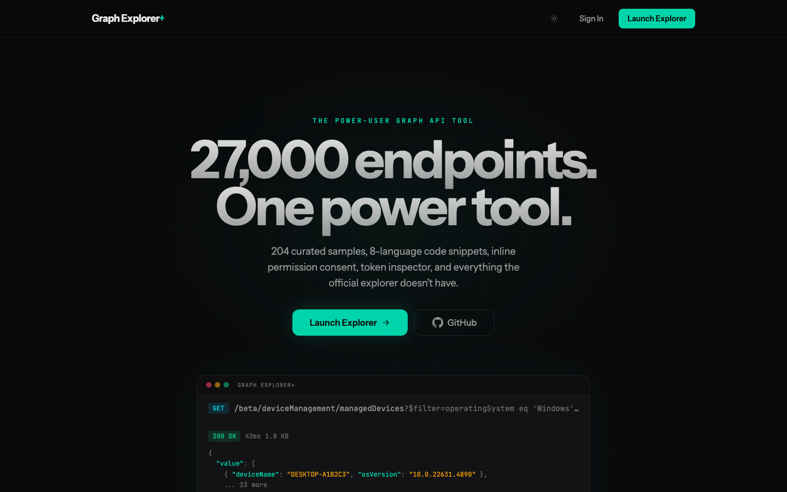
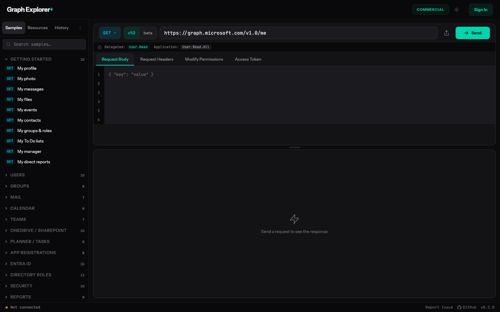

# Graph Explorer Plus

**[graphexplorerplus.vercel.app](https://graphexplorerplus.vercel.app)**

A power-user alternative to [Microsoft Graph Explorer](https://developer.microsoft.com/en-us/graph/graph-explorer) built with Next.js. Designed for IT admins, security engineers, and developers who live in the Graph API daily.

## Screenshots





## Why This Exists

The official Graph Explorer covers the basics. Graph Explorer Plus adds the features that power users have been asking for: 204 curated samples with deep Intune coverage, inline consent flows, 8-language code snippets, a browseable resource explorer, shareable query URLs, and sovereign cloud support.

## Features

### Code Snippets (8 Languages)

Every query generates ready-to-use code in PowerShell, JavaScript, C#, Python, Go, Java, PHP, and cURL. PowerShell is the default tab (using `Invoke-MgGraphRequest`). Each language includes links to its SDK and documentation.

### Resource Explorer

Browse all 27,000+ Graph API endpoints as a navigable tree. Search instantly, toggle between v1.0 and beta, and click any method badge to load it into the query builder.

### Permission Inspector & Consent Flow

See required scopes for any endpoint before you send the request. When a query returns 403, a consent banner appears with the missing scopes. Click "Consent & Retry" to grant permissions via MSAL popup and re-run the query without leaving the app.

### Modify Permissions

Browse and consent to individual Microsoft Graph permissions directly from the explorer. Permissions that are already granted appear greyed out.

### Token Viewer

Decode your current access token in real time. Inspect claims, expiration, scopes, and tenant info without leaving the app.

### Sovereign Cloud Endpoints

Switch between 5 Graph API environments. The URL bar, autocomplete, sample queries, and MSAL authority update together. Sovereign cloud access still requires an app registration and tenant in that cloud — this feature only switches the endpoints the explorer targets.

| Environment | Graph Endpoint |
|---|---|
| Global (Commercial) | `graph.microsoft.com` |
| US Gov (GCC High) | `graph.microsoft.us` |
| US Gov DoD | `dod-graph.microsoft.us` |
| Germany | `graph.microsoft.de` |
| China (21Vianet) | `microsoftgraph.chinacloudapi.cn` |

### 204 Sample Queries (25 Categories)

**General:** Getting Started, Users, Groups, Mail, Calendar, Teams, OneDrive/SharePoint, Planner/Tasks, App Registrations, Entra ID, Directory Roles, Security, Reports, Subscriptions

**Intune:** Devices, Compliance, Config, Apps, MAM, Enrollment, Scripts, Updates, Filters, Reporting, RBAC

### Share & Fullscreen

Copy a shareable URL for any query (encodes method, URL, version, and body). Expand responses to fullscreen for complex JSON payloads.

### Request History

All queries are persisted to localStorage. Click any history entry to reload it. Searchable and clearable.

### Additional Features

- **Draggable panel resize** between request and response panes
- **Binary response preview** with inline image rendering
- **Dark/light theme** with precision design tokens
- **Keyboard accessible** with focus-visible rings, ARIA roles, and reduced motion support
- **Endpoint autocomplete** with fuzzy search across 27,000+ paths

## Comparison with Official Graph Explorer

| Capability | Official | Plus |
|---|---|---|
| Code snippets | 4 languages (server-rendered) | 8 languages (client-side, with SDK links) |
| Resource explorer | Yes | Yes (tree + search + method badges) |
| Sample queries | ~40 | 204 across 25 categories |
| Intune coverage | Minimal | 11 dedicated categories |
| Inline consent flow | No | Yes (consent & retry) |
| Modify permissions | Yes | Yes (with greyed-out granted state) |
| Token viewer | No | Yes (JWT decode) |
| Shareable query URLs | Yes | Yes |
| Fullscreen response | No | Yes (portal modal) |
| Sovereign cloud endpoints | Partial | 5 environments (endpoint switching) |
| Persistent history | Session only | localStorage with search |
| Draggable panels | No | Yes |
| PowerShell-first | Listed last | Default tab |

## Quick Start

### 1. Create the App Registration

```powershell
# Requires Microsoft.Graph PowerShell module
./scripts/New-GraphExplorerPlusApp.ps1
```

Creates a multi-tenant SPA app registration with the necessary delegated permissions.

### 2. Configure Environment

```bash
cp .env.example .env
```

Set these values (the script outputs them):

```
NEXT_PUBLIC_MSAL_CLIENT_ID=<your-app-id>
NEXT_PUBLIC_MSAL_AUTHORITY=https://login.microsoftonline.com/common
NEXT_PUBLIC_MSAL_REDIRECT_URI=http://localhost:3000
```

### 3. Run

```bash
npm install
npm run dev
```

Open [http://localhost:3000](http://localhost:3000), sign in, and start querying.

## Architecture

```
src/
  app/
    page.tsx              # Landing page
    api/
      report-download/
        route.ts          # Server proxy for Graph Reports (CORS workaround)
    explorer/
      page.tsx            # Explorer layout
      _components/
        query-builder.tsx           # URL bar, method selector, headers/body/params tabs
        response-viewer.tsx         # Response body, headers, fullscreen expand
        code-snippets.tsx           # 8-language snippet generator
        resource-explorer.tsx       # 27K endpoint tree browser
        sidebar.tsx                 # Samples / Resources / History tabs
        sample-queries.tsx          # 204 curated queries
        history-panel.tsx           # Persistent request history
        permission-inspector.tsx    # Scope requirements per endpoint
        modify-permissions.tsx      # Browse and consent to permissions
        access-token-viewer.tsx     # JWT token decoder
        consent-banner.tsx          # 403 consent flow
        cloud-environment-dialog.tsx # Sovereign cloud switcher dialog
        header-bar.tsx              # App header, theme toggle, cloud switcher
        status-bar.tsx              # Response status bar
  lib/
    auth/
      msalConfig.ts       # MSAL configuration, cloud environments
      authUtils.ts        # Token acquisition helpers
      jwt-utils.ts        # JWT decoding utilities
    graph/
      client.ts           # Graph API client
      url-utils.ts        # URL parsing and manipulation
      method-styles.ts    # HTTP method styling
    data/
      endpoints.ts        # Endpoint metadata
      permissions.ts      # Permission definitions
    history-store.ts      # localStorage history persistence
    theme-store.ts        # Theme preference persistence
```

Authentication and most API calls happen client-side via MSAL.js. The Next.js server provides a single API route (`/api/report-download`) that proxies Graph Reports downloads to work around CORS restrictions on redirect URLs.

## Tech Stack

- [Next.js 15](https://nextjs.org) with React 19 and App Router
- [MSAL.js](https://github.com/AzureAD/microsoft-authentication-library-for-js) for Microsoft identity (client-side only)
- [Tailwind CSS v4](https://tailwindcss.com) with CSS-based design tokens
- [Playwright](https://playwright.dev) for end-to-end testing

## Contributing

[Open an issue](https://github.com/jorgeasaurus/graphexplorerplus/issues/new/choose) using the bug report or feature request template.

## License

MIT
